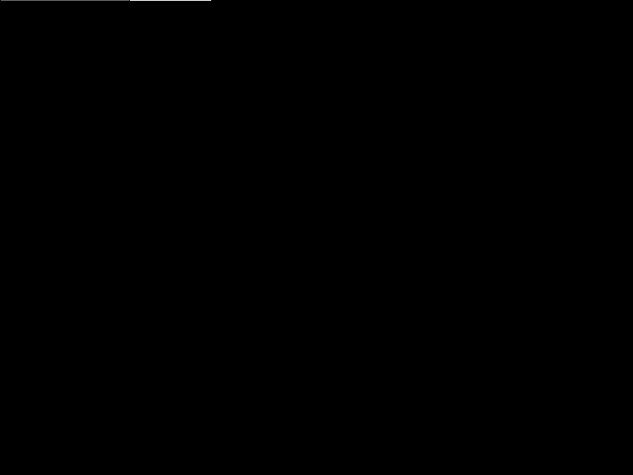

# AGP
## Advanced graphics programming Project2 - OpenGL - Deferred rendering
    by 
    Alejandro-Aurelio Gamarra Niño 
    José Antonio Prieto Garcia
    
Implementation of deferred rendering with light volumes.
- Using screen sized quad for directional lighting pass
- Using spheres volumes for point lighting pass

Advanced graphics techniques implemented:
- Deferred rendering with lighting volumes.
- z/depth pre pass optimizations (specially for forward rendering)
- Screen Space Ambient Occlusion
- Environment mapping

Shader programs:
- Geometry pass: renders all scene objects on a gBuffer for later process
- Lighting pass: render screen sized quads or spheres for every light on scene in additive form(fragment shader only process fragments of light volumes)
- Textured geometry: used for final on screen rendering of the user selected texture from the Info window combobox.
- SSAO pass: computes the screen ambient occlusion on a screen quad
- SSAO blur pass: blurs the resulting texture from the previous ssao pass
- Forward: re-added the old forward rendering program to be able to add a combo box and rendering pipeline option

## Overview of some implemented techniques

### Z Pre pass
To begin, z pre pass is a technique that we render at first all opaque meshes (or some meshes in a partial z pre pass, by general the big ones) in a depth buffer only, without color nor materials, only depth. Doing this we assure zero overdraw of all subsequent geometry draw calls, making all further calculations like heavy lighting shading on forward rendering worth the price.

Depth prepass or z pre pass, is a technique with forward rendering in mind, obtaining some benefits from the idea of the gbuffer from deferred rendering pipelines, but without the full extra cost of video memory. Also has the benefits, that having the depth information early on the rendering pipeline we can perform multitude of other techniques like SSAO, SSR, screen space/deferred shadows, occlusion culling, raytracing etc.

<table>
  <tr>
    <td>No Z pre pass</td>
    <td>With z pre pass</td>
  </tr>
  <tr>
     <td>  </td>
     <td>  </td>
  </tr>
 </table>
 
As we can see illustrated on the images above, doing the z pre pass (right image), in this case on the forward rendering, only
its performs the per fragment calls if the current geometry depth is equal to the one stored in the depth prepass, directly discarding the heavy calculations from the start.

### SSAO
Screen space ambient occlusion. Developed in 2007 by Crytek and used for first time on the game Crysis. With ssao we can improve the visual fidelity of our scenes, by simulating self shadows occlusion with good results for realtime applications.

<table>
  <tr>
    <td> SSAO on/off </td>
    <td> SSAO/SSAO blur</td>
  </tr>
  <tr>
     <td>  </td>
     <td>  </td>
  </tr>
 </table>

## Controls
### Camera
- keyboard keys W,A,S,D: navigation
- keyboard keys Q,E: move camera down, move camera up
- keyboard key C: 2x camera speed navigation
- mouse click + drag: camera rotation
### General
- keyboard key i: show gl related information
- Info window:
    - Choose between rendering pipelines
        - Forward rendering
        - Deferred rendering
    - Choose between different textures from the Gbuffer and others used fbo using the combobox:
        - position
        - normals
        - albedo
        - depth
        - depth grayscale (used for visualization purposes only)
        - SSAO
        - SSAO Blur
        - final pass (final scene texture after light pass applied)
    - Deferred pipeline only:
        - Checkbox to toggle SSAO pass/passes
        - Checkbox to toggle SSAO blurr pass
	- Checkbox to toggle Skybox rendering
	- Checkbox to toggle fake reflections

## Changelog:
### v0.1 - may 18 2021
First version with deferred shading with lighting volumes
- Decoupled geomery pass and lighting pass.
- Lighting pass uses lighting volumes for directional(screen sized quad), and spheres for point lights.
- Shader programs: 
    - Geometry pass: renders all scene objects on a gBuffer for later process
    - Lighting pass: render screen sized quads or spheres for every light on scene in additive form(fragment shader only process fragments of light volumes)
    - Textured geometry: used for final on screen rendering of the user selected texture from the Info window combobox.
### v0.2 - June 7 2021
Second/final deliverable additions.
- Added combo box to switch between renderer pipelines (forward/deferred)
- Added z pre pass optimization for both renderers
- z pre pass is used only for a first fast pass without materials, only depth for improve further passes speed (discarding heavy calculations on fragments that gonna be discarded), and opens the door for further post processing effects in forward pipeline.
- Added Screen Space Ambient Occlusion (SSAO) for deferred pipeline. (forward pipeline is ready to implement it, using depth from z pre pass, but not implemented)
- Environment mapping: Added skybox rendered after entities as optimization and specular fake reflections
- New Shader programs:
   - SSAO pass: computes the screen ambient occlusion on a screen quad
   - SSAO blur pass: blurs the resulting texture from the previous ssao pass
   - Forward: re-added the old forward rendering program to be able to add a combo box and rendering pipeline option
   - Skybox: render the skybox cubemap in the background of the scene using the z pre pass depth buffer
 
